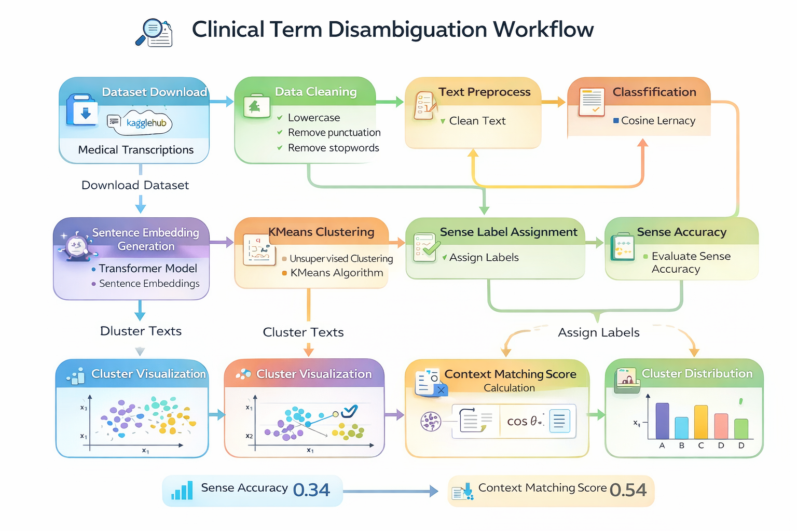

# Clinical Term Disambiguation using NLP

This project constructs a clinical term disambiguation workflow using medical transcription reports.

## Methods
- Sentence Transformers (all-MiniLM-L6-v2)
- Semantic sentence embeddings
- KMeans clustering for sense induction
- Context similarity evaluation

## Dataset
Medical Transcriptions Dataset (Kaggle)

## Evaluation Metrics
- Sense Accuracy
- Context Matching Score

## Results
Sense Accuracy: 0.34  
Context Matching Score: 0.546

These results demonstrate that transformer-based sentence embeddings effectively capture semantic similarity between clinical texts.
## Workflow Diagram

## Model Architecture

## Model Evaluation

